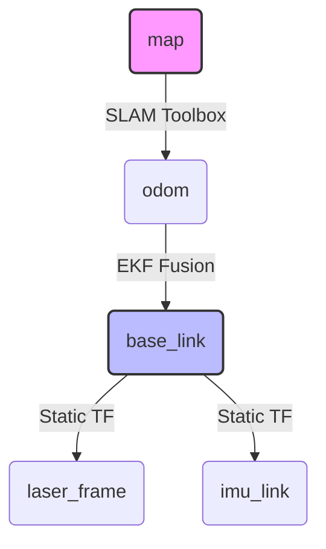

# 🤖 STM32 ROS 2 Navigation System
### 基于 Event-Replay EKF 的移动机器人自主导航方案

[](https://docs.ros.org/en/humble/)
[](https://www.st.com/)
[](https://www.python.org/)
[](LICENSE)

[核心特性] • [硬件架构] • [安装构建] • [快速开始] • [常见问题]


## 📖 项目简介 (Introduction)

本项目是基于 **STM32底层控制** 与 **ROS 2 Humble** 上位机的完整移动机器人解决方案。专为低成本**差速/滑移转向 (Skid-Steer)** 底盘设计，重点解决了低成本硬件中常见的**时间不同步**与**里程计漂移**问题。

核心亮点在于实现了 **Event-Replay EKF (事件回放式融合算法)**，在存在通信延迟的情况下，仍能保证毫秒级的姿态估算精度。

---

## ✨ 核心特性 (Key Features)

### 1. 🧠 Event-Replay EKF (事件回放融合)
解决了传统 EKF 因串口通信延迟导致的时序混乱问题：
* **乱序重排**：利用 STM32 硬件毫秒级时间戳，对 Odom 和 IMU 数据进行严格的时间序列重排。
* **历史回放**：在状态更新时，严格按照物理事件发生的顺序回放数据，确保“先旋转后平移”的积分计算精确无误。

### 2. 🎯 针对性里程计校正
针对滑移转向底盘的物理缺陷进行了多重算法补偿：
* **滑移补偿 (`skid_steer_slip_factor`)**：修正因轮胎横向摩擦导致的旋转角度不足（默认系数 1.6）。
* **线性修正 (`linear_correction_factor`)**：修正轮胎形变导致的直线行驶误差。
* **死区过滤**：底层固件配合上位机算法，滤除静止时的编码器抖动噪点。

### 3. ⏳ 软硬件全栈时间同步
* 启动握手时自动发送 `T<timestamp>` 指令，计算上位机与 MCU 的时钟偏差，确保 TF 变换树的时间戳精准对齐，消除 `Extrapolation into the future` 警告。

---

## 🛠️ 硬件架构 (Hardware)

| 组件 | 推荐型号/参数 | 备注 |
| :--- | :--- | :--- |
| **上位机** | Orange Pi 5 / PC | Ubuntu 22.04 (ROS 2 Humble) |
| **底层主控** | STM32F103RCT6 | 负责电机 PID 闭环与传感器采集 |
| **激光雷达** | RPLIDAR S2 / A1 / A2 | 2D SLAM 建图与避障 |
| **IMU** | MPU6050 / GY-85 | 6轴姿态数据 (Yaw角积分) |
| **底盘结构** | 4轮差速 / 履带式 | 霍尔编码器 (330脉冲/圈) |

---

## 📦 安装与构建 (Installation)

### 1. 系统依赖
```bash
# 安装 ROS 2 Navigation2 及 SLAM 相关依赖
sudo apt update
sudo apt install ros-humble-slam-toolbox ros-humble-navigation2 ros-humble-nav2-bringup ros-humble-xacro

# 安装 Python 串口通信库
pip3 install pynput serial pyserial numpy

```

### 2. 克隆与编译

```bash
mkdir -p ~/ros2_ws/src
cd ~/ros2_ws/src

# 克隆本仓库
git clone [https://github.com/DLDLDL13579/stm32-robot-base.git](https://github.com/DLDLDL13579/stm32-robot-base.git)

cd ..
# 使用 symlink 安装 (便于调试 Python 代码无需重复编译)
colcon build --symlink-install
source install/setup.bash

```

### 3. 串口权限配置

为保证 ROS 节点能访问硬件，需配置 USB 权限（建议配置 udev 规则，此处为临时方案）：

```bash
sudo chmod 777 /dev/ttyUSB*

```

---

## 🚀 快速开始 (Quick Start)

### 一键启动 SLAM 建图

该 Launch 文件将自动启动：底层驱动、传感器融合节点、SLAM Toolbox 及 RViz2。

```bash
ros2 launch my_robot_slam slam_mapping.launch.py

```

### ⌨️ 键盘控制

程序启动后，终端将进入监听模式。请保持终端窗口处于**激活状态**：

| 按键 | 功能 | 说明 |
| --- | --- | --- |
| **`W`** | 前进 | 线性速度增加 |
| **`S`** | 后退 | 线性速度减少 |
| **`A`** | 左转 | 角速度增加 |
| **`D`** | 右转 | 角速度减少 |
| **`SPACE`** | **急停** | 速度强制置零 |
| **`ESC`** | 退出 | 关闭节点 |

> **提示**：你也可以另开一个终端使用标准话题控制：
> ```bash
> ros2 topic pub /cmd_vel geometry_msgs/msg/Twist "{linear: {x: 0.2}, angular: {z: 0.0}}"
> 
> ```
> 
> 

---

## ⚙️ 参数配置 (Configuration)

核心物理参数位于 `src/my_robot_slam/launch/slam_mapping.launch.py`，请务必根据实际车辆修改：

```python
# 车辆物理参数
'wheel_base': '0.18',     # 前后轮轴距 (m)
'wheel_track': '0.17',    # 左右轮轮距 (m)
'wheel_radius': '0.0335', # 轮胎半径 (m)

# 编码器参数
'pulses_per_revolution': '1320.0', # 一圈总脉冲数 (线数 x 减速比 x 4)

# 校准参数
'skid_steer_slip_factor': '1.6',   # 滑移转向补偿 (值越大，计算出的旋转角度越小)

```

---

## 📡 通信协议 (Protocol)

上位机与 STM32 采用 **ASCII 字符串** 交互，波特率 **115200**。

### 1. 上行数据 (STM32 -> ROS)

| 标识头 | 格式示例 | 说明 |
| --- | --- | --- |
| **编码器** | `/four_wheel_encoder,100,100,100,100,12345` | 四轮脉冲累计值 + 时间戳 |
| **IMU** | `/imu_data,120,30,16384,5,-2,1,25,12345` | 加速度, 角速度, 温度, 时间戳 |

### 2. 下行指令 (ROS -> STM32)

* **运动控制**：直接发送字符 `W`, `S`, `A`, `D`, `SPACE` (急停)。
* **时间同步**：`T<timestamp>` (例如 `T1703421500`)，用于对齐系统时间。

---

## 📊 坐标系 (TF Tree)

系统严格遵循 [ROS REP-105](https://www.ros.org/reps/rep-0105.html) 标准：



---

## ❓ 常见问题 (FAQ)

<details>
<summary><strong>Q1: 机器人实际旋转 90 度，但 RViz 中只显示 60 度？</strong></summary>

这是滑移转向底盘的常见物理特性。
**解决方法**：增大 `skid_steer_slip_factor` 参数（例如从 1.6 调至 2.0），直到 RViz 显示角度与实际一致。

</details>

<details>
<summary><strong>Q2: 建图时地图出现重影或跳变？</strong></summary>

1. 检查 IMU 是否校准（静止启动等待 3-5 秒）。
2. 确认雷达 TF (`laser_to_base_link`) 安装位置参数是否准确。
3. 检查 STM32 底层是否在静止时仍有微小脉冲输出（需在底层开启死区过滤）。

</details>

---

<div align="center">

**Project**: Undergraduate Thesis - Lidar SLAM Robot


**Author**: Deng Lin

</div>

```

```