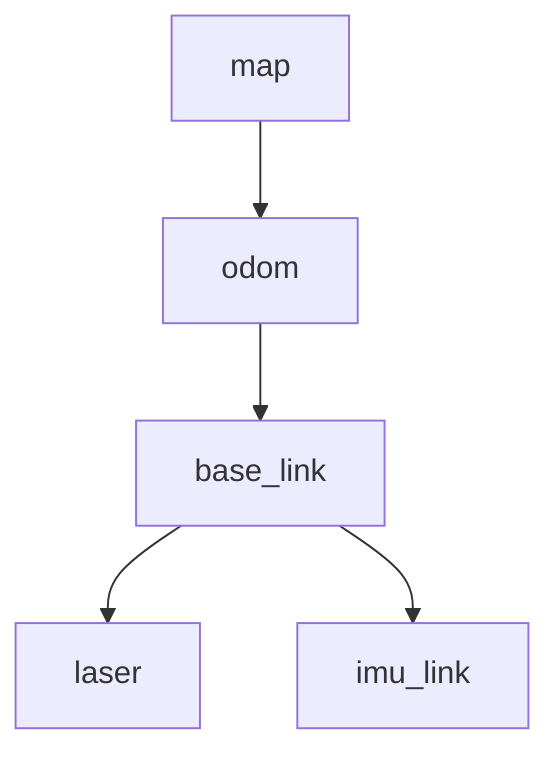

---

```markdown
# STM32 ROS 2 Navigation & Control System


> **基于 STM32 底层与 ROS 2 上位机的移动机器人自主导航系统**
> 
> 本项目包含完整的底层驱动、传感器融合算法（EKF）及 SLAM 建图配置，专为低成本差速/滑移转向底盘设计，解决了硬件时间不同步与里程计漂移等核心痛点。

---

## 📖 目录 (Table of Contents)

- [✨ 核心特性 (Key Features)](#-核心特性-key-features)
- [🛠️ 硬件架构 (Hardware Architecture)](#-硬件架构-hardware-architecture)
- [📦 安装与构建 (Installation)](#-安装与构建-installation)
- [🚀 快速开始 (Quick Start)](#-快速开始-quick-start)
- [⚙️ 参数配置 (Configuration)](#-参数配置-configuration)
- [📡 通信协议 (Communication Protocol)](#-通信协议-communication-protocol)
- [📊 坐标系与 TF (Coordinate Systems)](#-坐标系与-tf-coordinate-systems)
- [❓ 常见问题 (Troubleshooting)](#-常见问题-troubleshooting)

---

## ✨ 核心特性 (Key Features)

本项目针对实际硬件调试中遇到的问题，实现了以下特有算法：

### 1. 🧠 Event-Replay EKF (事件回放式融合)
传统的 EKF 容易受串口通信延迟影响导致时序混乱。本驱动采用 **Event-Replay** 机制：
* **乱序重排**：利用 STM32 上传的硬件毫秒级时间戳，将 Odom 和 IMU 数据重新排序。
* **历史回放**：在更新状态时，严格按照物理事件发生的先后顺序回放数据，确保“先旋转后平移”或“边旋转边平移”的积分计算精确无误。

### 2. 🎯 精准里程计校正
针对差速小车（Skid-Steer）的物理特性进行了多重补偿：
* **滑移转向补偿 (`skid_steer_slip_factor`)**：修正因轮胎横向摩擦导致的旋转角度不足问题（默认系数 1.6）。
* **线性距离修正 (`linear_correction_factor`)**：修正轮胎受压变形或打滑导致的直线行驶误差（默认系数 1.236）。
* **智能死区过滤**：配合底层固件，滤除静止状态下的编码器抖动。

### 3. ⏳ 软硬件时间同步
* 实现了上位机与 MCU 的时钟对齐。启动时自动发送 `T<timestamp>` 指令，计算并补偿系统时间偏差，确保 TF 变换树的时间戳精准匹配。

---

## 🛠️ 硬件架构 (Hardware Architecture)

| 组件 | 推荐型号/参数 | 说明 |
| :--- | :--- | :--- |
| **上位机** | Orange Pi 5 / PC | 运行 Ubuntu 22.04 + ROS 2 Humble |
| **底层主控** | STM32F103RCT6 | 运行配套固件，负责电机 PID 与传感器采集 |
| **激光雷达** | RPLIDAR S2 / A1 / A2 | 用于 SLAM 建图与避障 |
| **IMU** | MPU6050 | 6轴姿态传感器，提供角速度与加速度 |
| **编码器** | AB相增量式 | 11线霍尔 x 30减速比 = 330脉冲/圈 (4倍频后1320) |

---

## 📦 安装与构建 (Installation)

### 1. 系统依赖
确保已安装 ROS 2 Humble 及基础工具：
```bash
sudo apt update
sudo apt install ros-humble-slam-toolbox ros-humble-navigation2 ros-humble-nav2-bringup ros-humble-xacro
pip3 install pynput serial pyserial numpy

```

### 2. 克隆与编译

```bash
mkdir -p ~/ros2_ws/src
cd ~/ros2_ws/src
git clone <本仓库地址>
cd ..

# 使用 symlink 安装以便于调试 Python 代码
colcon build --symlink-install
source install/setup.bash

```

### 3. 串口权限配置

为避免每次使用 sudo，请添加串口权限规则（假设雷达为 `ttyUSB0`，STM32为 `ttyUSB2`）：

```bash
# 临时授权
sudo chmod 777 /dev/ttyUSB*

# 或永久生效 (推荐)
sudo usermod -aG dialout $USER

```

---

## 🚀 快速开始 (Quick Start)

### 一键启动 SLAM 建图

运行主 Launch 文件，这将同时启动底层驱动、雷达、EKF 融合节点、SLAM Toolbox 及 RViz2。

```bash
ros2 launch my_robot_slam slam_mapping.launch.py

```

### 键盘控制说明

节点启动后，终端将进入键盘监听模式（需保持终端窗口激活）：

* **`W` / `S**` : 线性加速 / 减速 (前进/后退)
* **`A` / `D**` : 角速度增加 / 减少 (左转/右转)
* **`SPACE`** : **急停** (速度置零)
* **`ESC`** : 退出程序

> **提示**: 您也可以在另一个终端使用标准 ROS 指令控制：
> ```bash
> ros2 topic pub /cmd_vel geometry_msgs/msg/Twist "{linear: {x: 0.2}, angular: {z: 0.0}}"
> 
> ```
> 
> 

---

## ⚙️ 参数配置 (Configuration)

核心物理参数位于 `src/my_robot_slam/launch/slam_mapping.launch.py`，请根据实际车辆调整：

| 参数名 | 默认值 | 描述 |
| --- | --- | --- |
| `wheel_base` | **0.18** | 前后轮轴距 (m) |
| `wheel_track` | **0.17** | 左右轮轮距 (m) |
| `wheel_radius` | **0.0335** | 轮胎半径 (m) |
| `pulses_per_revolution` | **1320.0** | 编码器一圈总脉冲数 (线数 × 减速比 × 4) |
| `skid_steer_slip_factor` | **1.6** | 滑移转向补偿系数 (值越大，计算出的旋转角度越小) |
| `serial_port` | `/dev/ttyUSB2` | STM32 连接的串口号 |
| `lidar_port` | `/dev/ttyUSB0` | 激光雷达连接的串口号 |

---

## 📡 通信协议 (Communication Protocol)

上位机与 STM32 采用 **ASCII 字符串** 格式交互，波特率 **115200**。

### 1. 上行数据 (STM32 -> ROS)

| 内容 | 格式 | 示例 |
| --- | --- | --- |
| **编码器** | `/four_wheel_encoder,<e1>,<e2>,<e3>,<e4>,<ts>` | `/four_wheel_encoder,100,100,100,100,12345` |
| **IMU** | `/imu_data,<ax>,<ay>,<az>,<gx>,<gy>,<gz>,<temp>,<ts>` | `/imu_data,120,30,16000,5,-2,1,25,12345` |

> `ts` 为 STM32 系统启动后的毫秒级时间戳。

### 2. 下行指令 (ROS -> STM32)

| 功能 | 指令字符 | 说明 |
| --- | --- | --- |
| **前进** | `W` | 触发平滑加速逻辑 |
| **后退** | `S` | - |
| **左转** | `A` | 差速原地旋转 |
| **右转** | `D` | - |
| **停止** | `SPACE` | PWM 输出置零 (空挡滑行) |
| **时间同步** | `T<timestamp>` | 发送当前 Unix 时间戳 (ms) |

---

## 📊 坐标系与 TF (Coordinate Systems)

系统严格遵循 [REP-105](https://www.ros.org/reps/rep-0105.html) 标准：



* **map -> odom**: 由 `slam_toolbox` 广播，用于修正长时间运行的累积误差。
* **odom -> base_link**: 由 `four_wheel_ekf_node` 广播，基于编码器与 IMU 的高频融合推算。
* **base_link -> sensors**: 静态 TF 变换，在 launch 文件中定义（需根据传感器实际安装位置修改 xyz 参数）。

---

## ❓ 常见问题 (Troubleshooting)

**Q1: 机器人实际旋转 90 度，但 RViz 中只旋转了 60 度？**

* **A**: 这是滑移转向底盘的常见现象。请增大 `skid_steer_slip_factor` 参数（例如从 1.6 调至 2.0），直到 RViz 显示角度与实际一致。

**Q2: 启动时报错 `Permission denied: '/dev/ttyUSBx'`？**

* **A**: 串口权限不足。请运行 `sudo chmod 777 /dev/ttyUSBx` 或检查 udev 规则。

**Q3: 建图时地图出现重影或跳变？**

* **A**:
1. 检查 IMU 是否校准（静止启动等待 3-5 秒）。
2. 确认雷达 TF (`laser_to_base_link`) 安装位置参数是否准确。
3. 检查 STM32 底层是否在静止时仍有微小脉冲输出（需在底层开启死区过滤）。


---

**Author**: Deng Lin

**Project**: Undergraduate Thesis - Lidar SLAM Robot

```

```