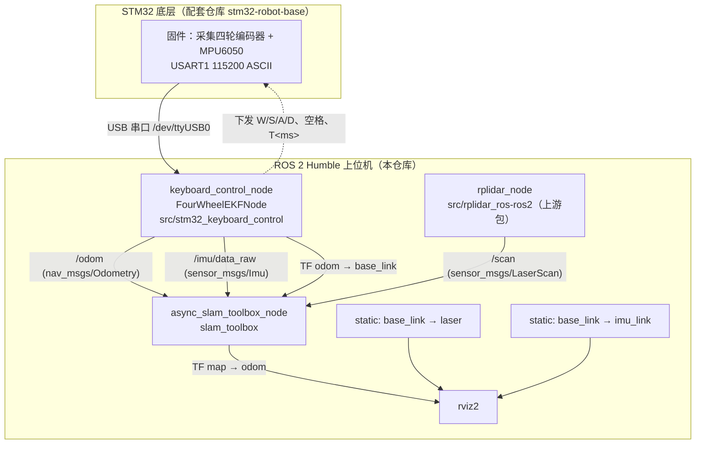
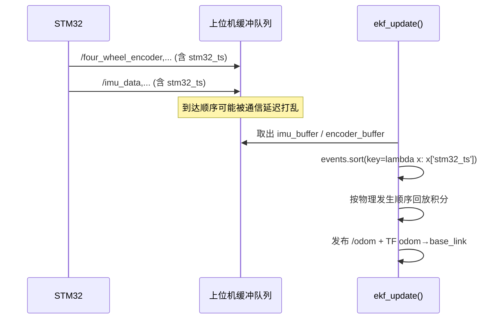
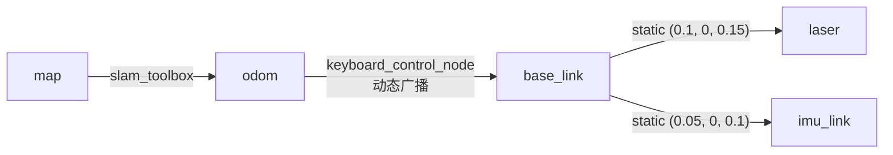

# STM32 ROS 2 Navigation System

### 基于 Event-Replay 融合的移动机器人 SLAM 上位机

[](https://docs.ros.org/en/humble/)
[](https://www.st.com/)
[](https://www.python.org/)

> ROS 2 Humble 上位机工作区：通过串口读取 STM32 的编码器与 IMU，
> 做**基于硬件时间戳的事件回放式融合**，产出 `/odom` 与 TF，配合 slam_toolbox 建图。
>
> 配套的 STM32 底层固件在另一个仓库 **`stm32-robot-base`**。

---

## 目录

- [系统结构](#系统结构)
- [工作区包说明](#工作区包说明)
- [核心机制：Event-Replay 融合](#核心机制event-replay-融合)
- [坐标系与 TF](#坐标系与-tf)
- [话题一览](#话题一览)
- [安装与构建](#安装与构建)
- [快速开始](#快速开始)
- [常见问题](#常见问题)
- [归属与许可证](#归属与许可证)

---

## 系统结构


```mermaid
graph TB
    subgraph MCU["STM32 底层（配套仓库 stm32-robot-base）"]
        FW["固件：采集四轮编码器 + MPU6050<br/>USART1 115200 ASCII"]
    end

    subgraph ROS2["ROS 2 Humble 上位机（本仓库）"]
        KCN["keyboard_control_node<br/>FourWheelEKFNode<br/>src/stm32_keyboard_control"]
        RPL["rplidar_node<br/>src/rplidar_ros-ros2（上游包）"]
        SLAM["async_slam_toolbox_node<br/>slam_toolbox"]
        RVIZ["rviz2"]
        TF1["static: base_link → laser"]
        TF2["static: base_link → imu_link"]
    end

    FW -->|"USB 串口 /dev/ttyUSB0"| KCN
    KCN -->|"/odom (nav_msgs/Odometry)"| SLAM
    KCN -->|"/imu/data_raw (sensor_msgs/Imu)"| SLAM
    KCN -->|"TF odom → base_link"| SLAM
    RPL -->|"/scan (sensor_msgs/LaserScan)"| SLAM
    SLAM -->|"TF map → odom"| RVIZ
    TF1 --> RVIZ
    TF2 --> RVIZ
    KCN -.->|"下发 W/S/A/D、空格、T&lt;ms&gt;"| FW
```

---

## 工作区包说明

`src/` 下共 3 个包：

| 包 | 类型 | 内容 |
|---|---|---|
| **`stm32_keyboard_control`** | ament_python | **核心**：串口解析、时间同步、事件回放融合、键盘遥控。节点 `keyboard_control_node`（类 `FourWheelEKFNode`，`keyboard_control_node.py`，624 行） |
| **`my_robot_slam`** | ament_python | **无节点**（`setup.py` 的 `console_scripts` 为空），仅承载 launch / config / rviz 配置 |
| **`rplidar_ros`** | ament_cmake | **上游第三方包**（目录名 `rplidar_ros-ros2`），见 [归属与许可证](#归属与许可证) |

---

## 核心机制：Event-Replay 融合

低成本串口链路存在**通信延迟**，编码器与 IMU 数据到达上位机的顺序可能与真实发生顺序不一致，直接积分会导致姿态解算错误。

本项目的处理方式是：STM32 在每帧数据里附带的**毫秒级硬件时间戳**（`stm32_ts`），上位机把它和编码器 / IMU 数据一起入缓冲，融合前先按时间戳排序再回放。


```mermaid
sequenceDiagram
    participant MCU as STM32
    participant BUF as 上位机缓冲队列
    participant FUSE as ekf_update()
    MCU->>BUF: /four_wheel_encoder,... (含 stm32_ts)
    MCU->>BUF: /imu_data,... (含 stm32_ts)
    Note over BUF: 到达顺序可能被通信延迟打乱
    FUSE->>BUF: 取出 imu_buffer / encoder_buffer
    FUSE->>FUSE: events.sort(key=lambda x: x['stm32_ts'])
    FUSE->>FUSE: 按物理发生顺序回放积分
    FUSE->>FUSE: 发布 /odom + TF odom→base_link
```

关键代码位置（`keyboard_control_node.py`）：

| 方法 | 行号附近 | 作用 |
|---|---|---|
| `parse_four_wheel_data()` | 132 | 解析编码器帧，打包 `{'type', 'stm32_ts', ...}` 入 `encoder_buffer` |
| `parse_imu_data()` | 179 | 解析 IMU 帧，取 `parts[8]` 为 `stm32_ts`，入 `imu_buffer` |
| `ekf_update()` | 273 | 合并两个缓冲，`events.sort(key=lambda x: x['stm32_ts'])` 后按序回放 |
| `publish_odometry()` | 339 | 发布 `nav_msgs/Odometry` 与 TF |
| `publish_imu_data()` | 386 | 发布 `sensor_msgs/Imu` |
| `sync_stm32_time()` | 422 | 下发 `T<ms>` 完成上下位机时间同步 |

> **说明**：该方法按硬件时间戳重排后做**角度赋值 + 位移积分**，
> 并非严格意义上的卡尔曼滤波（无协方差预测 / 更新与增益计算）。
> 名称沿用代码中的 `FourWheelEKFNode` 与 `ekf_update`。

---

## 坐标系与 TF


```mermaid
graph LR
    MAP["map"] -->|"slam_toolbox"| ODOM["odom"]
    ODOM -->|"keyboard_control_node<br/>动态广播"| BASE["base_link"]
    BASE -->|"static (0.1, 0, 0.15)"| LASER["laser"]
    BASE -->|"static (0.05, 0, 0.1)"| IMU["imu_link"]
```

静态 TF 来自 `src/my_robot_slam/launch/slam_mapping.launch.py`：

| 父 → 子 | 平移 (x, y, z) |
|---|---|
| `base_link` → `laser` | `0.1, 0, 0.15` |
| `base_link` → `imu_link` | `0.05, 0, 0.1` |

帧名可通过参数覆盖：`odom_frame_id`（默认 `odom`）、`base_frame_id`（默认 `base_link`）、`imu_frame_id`（默认 `imu_link`）。

---

## 话题一览

| 话题 | 类型 | 方向 | 来源 |
|---|---|---|---|
| `/odom` | `nav_msgs/Odometry` | 发布 | `keyboard_control_node` |
| `/imu/data_raw` | `sensor_msgs/Imu` | 发布 | `keyboard_control_node` |
| `/scan` | `sensor_msgs/LaserScan` | 发布 | `rplidar_node` |
| `/tf`、`/tf_static` | — | 发布 | 融合节点 + static_transform_publisher |

串口参数（默认）：`/dev/ttyUSB0`，波特率 **115200**。

雷达参数（`slam_mapping.launch.py` 中设定）：`serial_baudrate` **1000000**、`frame_id` `laser`、`scan_mode` `DenseBoost`。

---

## 安装与构建

```bash
mkdir -p ~/ros2_ws/src && cd ~/ros2_ws/src
git clone https://github.com/DLDLDL13579/stm32-ros2-navigation.git
cd ~/ros2_ws
rosdep install --from-paths src --ignore-src -r -y
colcon build --symlink-install
source install/setup.bash
```

依赖：`rclpy`、`std_msgs`、`geometry_msgs`、`nav_msgs`、`sensor_msgs`、`tf2_ros`、
`slam_toolbox`、`rplidar_ros`（随仓库提供）、`pyserial`。

> 注意：`build/`、`install/`、`log/` 为 colcon 构建产物，**当前已被 git 跟踪**；
> 建议加入 `.gitignore` 后清理，可显著减小仓库体积。

---

## 快速开始

```bash
source ~/ros2_ws/install/setup.bash
ros2 launch my_robot_slam slam_mapping.launch.py
```

该 launch（151 行）会一并启动：

1. `keyboard_control_node`（串口解析 + 融合）
2. `rplidar_node`（雷达）
3. `async_slam_toolbox_node`（slam_toolbox 建图）
4. `rviz2`（加载预设配置）
5. `static_transform_publisher` ×2（laser、imu_link）
6. `tf2_monitor`（监视 `map` → `base_link`）

SLAM 参数见 `src/my_robot_slam/config/my_slam_params.yaml`（`scan_topic: /scan`，分辨率 `0.05`）。

键盘遥控在 `keyboard_control_node` 内实现（`on_key_press` / `on_key_release`），按键映射为 `W` / `S` / `A` / `D`，松开或超时自动停止。

---

## 常见问题

<details>
<summary><strong>Q1: 串口打不开 / 没有 /odom？</strong></summary>

1. 确认设备节点：`ls /dev/ttyUSB*`，必要时用参数覆盖 `serial_port`
2. 确认波特率与底层一致（115200）
3. 当前用户需有串口权限：`sudo usermod -aG dialout $USER`（重新登录后生效）

</details>

<details>
<summary><strong>Q2: 建图出现重影或跳变？</strong></summary>

1. 检查 IMU 是否校准（静止启动等待 3–5 秒）
2. 确认雷达 TF（`base_link` → `laser`）安装位置参数是否准确
3. 检查 STM32 底层静止时是否仍有微小脉冲输出（需在底层开启死区过滤，
   见配套仓库 `stm32-robot-base`）

</details>

<details>
<summary><strong>Q3: 融合节点在哪个包？</strong></summary>

在 **`stm32_keyboard_control`**（`keyboard_control_node.py`）。
`my_robot_slam` 只包含 launch / config / rviz，本身没有节点。

</details>

---

## 归属与许可证

- **本仓库根目录没有 LICENSE 文件**，因此不声明统一许可证，各包以其自身声明为准：

| 包 | 声明 |
|---|---|
| `my_robot_slam` | `package.xml` 中声明 `Apache-2.0`（仓库内无对应 LICENSE 文件） |
| `stm32_keyboard_control` | `package.xml` 中声明 `TODO: License declaration`（**尚未确定**） |
| `rplidar_ros` | **BSD**，附独立 `LICENSE` 文件 |

- **`rplidar_ros` 为上游第三方包**（目录名 `rplidar_ros-ros2`，version 2.1.4，
  maintainer `deyou.wang@slamtec.com`，author `ros@slamtec.com`）。
  其 `LICENSE` 明确版权为：
  **Copyright (c) 2009–2014 RoboPeak Team**、
  **Copyright (c) 2014–2018 Shanghai Slamtec Co., Ltd.**，遵循 BSD 条款。
  该包的权利归原作者所有，本仓库仅随工作区一并引入。
- 雷达产品图 `src/rplidar_ros-ros2/rplidar_A1.png`、`rplidar_A2.png` 同样来自该上游包。

---

## 代码规模

| 文件 | 行数 |
|---|---|
| `src/stm32_keyboard_control/stm32_keyboard_control/keyboard_control_node.py` | 624 |
| `src/my_robot_slam/launch/slam_mapping.launch.py` | 151 |
| `src/my_robot_slam/config/my_slam_params.yaml` | 57 |

---

<div align="center">

**Project**: Undergraduate Thesis - Lidar SLAM Robot

**Author**: Deng Lin

</div>
